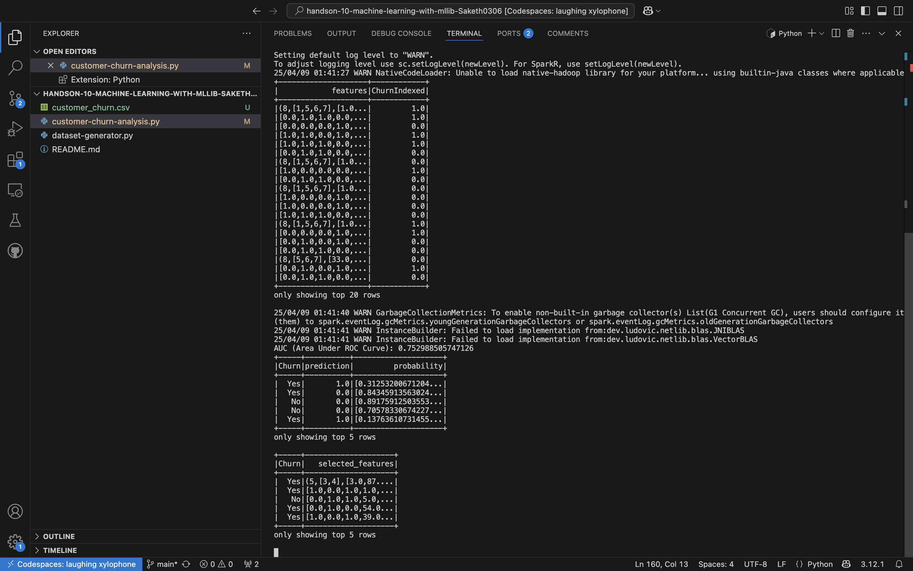

Customer Churn Prediction using PySpark MLlib
📌 Objective
This project demonstrates how to preprocess data, build classification models, select features, and optimize hyperparameters using Apache Spark MLlib for predicting customer churn.

🔧 Setup
Prerequisites:
Python 3.x

Apache Spark (3.x)

PySpark

Dataset: customer_churn.csv (must be in the same directory or specify path)

Run the script:
bash
spark-submit churn_prediction.py
🧠 Project Tasks
✅ Task 1: Data Preprocessing and Feature Engineering
Goal: Clean data, encode categorical variables, and prepare features for ML.

Steps:

Fill missing TotalCharges with 0.

Convert gender, PhoneService, and InternetService to numeric indices using StringIndexer.

One-hot encode these indexed columns using OneHotEncoder.

Combine features using VectorAssembler to create a unified features column.

✅ Task 2: Logistic Regression Model Training and Evaluation
Goal: Build a binary classification model and assess its performance.

Steps:

Split data (80% training, 20% testing).

Train a LogisticRegression model.

Evaluate using BinaryClassificationEvaluator with metric areaUnderROC.

✅ Task 3: Feature Selection with Chi-Square
Goal: Identify top 5 features most correlated with churn.

Steps:

Use ChiSqSelector to select top features.

Output selected features and Churn labels.

✅ Task 4: Hyperparameter Tuning and Model Comparison
Goal: Compare multiple models and identify the best performing one.

Models Tuned:

Logistic Regression

Decision Tree

Random Forest

Gradient Boosted Trees

Steps:

Use CrossValidator and ParamGridBuilder for hyperparameter tuning.

Perform 3-fold cross-validation.

Evaluate using AUC score.

Print best AUC scores for each model.

📂 Project Structure

churn_prediction.py        # Main script with all ML tasks
customer_churn.csv         # Input dataset

📈 Output
The script prints:

Preprocessed features and labels

AUC score for Logistic Regression

Top 5 selected features from Chi-Square test

AUC scores for all models (LR, DT, RF, GBT)

🧾 Code Explanation
🔹 Preprocessing

df = df.fillna({'TotalCharges': 0})
Handles missing values in the TotalCharges column.

StringIndexer(...) → OneHotEncoder(...)
Encodes categorical columns into numeric format, then applies one-hot encoding to retain categorical context.

VectorAssembler(inputCols=[...], outputCol="features")
Combines all relevant features into one column to feed into ML models.

🔹 Model Training (Logistic Regression)

train_data, test_data = df.randomSplit([0.8, 0.2])
lr = LogisticRegression(...)
auc = BinaryClassificationEvaluator(...).evaluate(predictions)
Trains a model on training data, evaluates with AUC (area under the ROC curve), a popular metric for binary classification.

🔹 Feature Selection

ChiSqSelector(..., numTopFeatures=5)
Applies a statistical test to rank features by relevance to the target (Churn).

🔹 Hyperparameter Tuning & Model Comparison

CrossValidator(estimator=..., estimatorParamMaps=..., evaluator=..., numFolds=3)
Tunes each model using cross-validation over a grid of hyperparameters.

evaluator.evaluate(predictions)
Evaluates each tuned model’s prediction on test data using AUC.

✅ Conclusion
This project provides a complete pipeline for churn prediction:

Clean and transform data.

Build and evaluate models.

Select best features.

Tune models and compare their performance.

The modular structure ensures it's easy to extend with new models or data sources.
